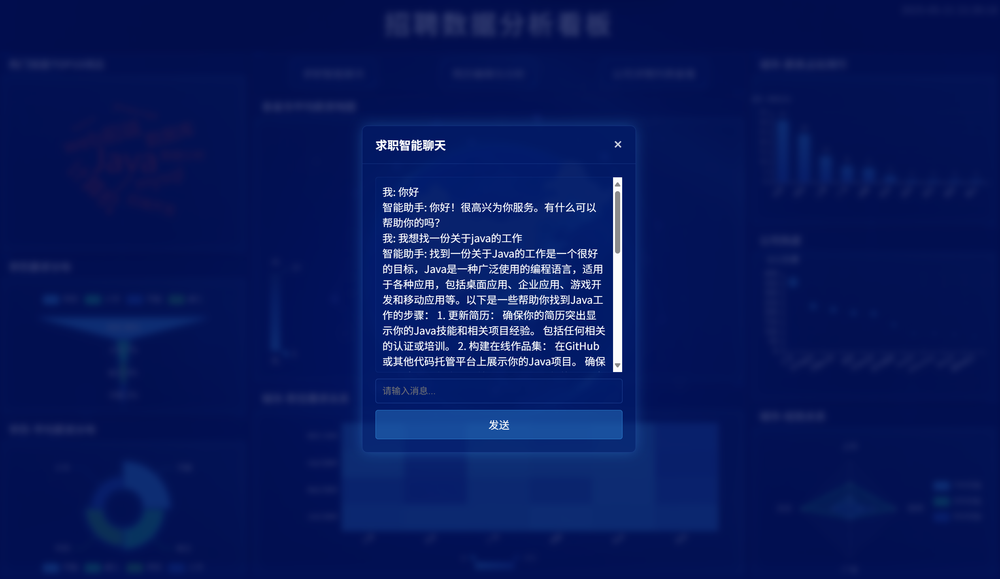
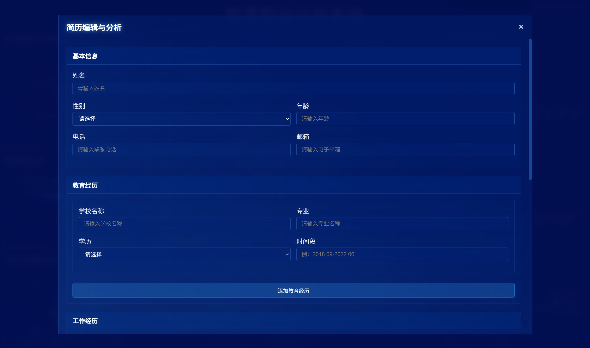

# SpringBoot+Vue+Echarts招聘数据分析大屏

## 项目介绍

基于SpringBoot+Vue3+Echarts的招聘数据分析大屏，后续会完善使用Redis、RabbitMQ等技术栈，以及对于大模型使用的探索。

## 效果图

  
   
  <em>大屏界面</em>

  
   
  <em>AI交互聊天界面（暂时为调用kimiAPI的示例功能）</em>

  
   
  <em>简历编辑界面</em>

## 放假后再说

### 计划功能
- **技术栈**
  - 爬虫功能：爬取来源更多样，代码更简洁。
  - 求职智能聊天：对话历史存储，并显示历史记录；支持上传大模型支持的文件格式附件，让大模型进行分析；计划实时文本流传输。
- **求职者端**
  - 简历编辑与分析：保存简历信息并输出模板，支持图片上传；利用大模型分析简历内容，以提供修改与投递意见等。
  - 热门职位搜索：允许求职者搜索热门职位，返回符合条件的职位信息及链接，且可收藏职位。
- **HR端**
  - 公司信息编辑与分析：类似于求职者端的简历编辑与分析功能。
  - 求职沟通：实现实时聊天功能，包括HR给求职者打招呼、求职者发送简历附件等功能。
  - 求职岗位与HR智能推荐：根据清洗后的爬虫数据推荐合适岗位连接，以及基于用户上传简历向HR推荐候选人。
- **其他功能**
  - 空间动态：HR与求职者可以发布各种动态。
  - 消息队列：采用RabbitMQ异步处理大量数据和请求。

## 快速开始

## 启动问题解决

### 后端

#### 1. Lombok组件中注解实现setter/getter无法被正确识别, 控制台输出：
java: 找不到符号
符号： 方法 getUsername()
位置： 类型为com.example.demo.pojo.User的变量 user

**解决方法：** [参考解决方案](https://blog.csdn.net/2403_82614686/article/details/146001137?sharetype=blogdetail&shareId=146001137&sharerefer=APP&sharesource=2403_82614686&sharefrom=qq)

#### 2. Springboot日志输出端口被占用

**解决方法：** 在`application.properties`中更改端口（`server.port`）

#### 3. 更改数据库名称

### 前端

#### 1. 前端图表显示不完全

**解决方法：** 检查端口，在每个图表的vue文件中检查axios发送的POST请求中的端口是否与`application.properties`中的一致。